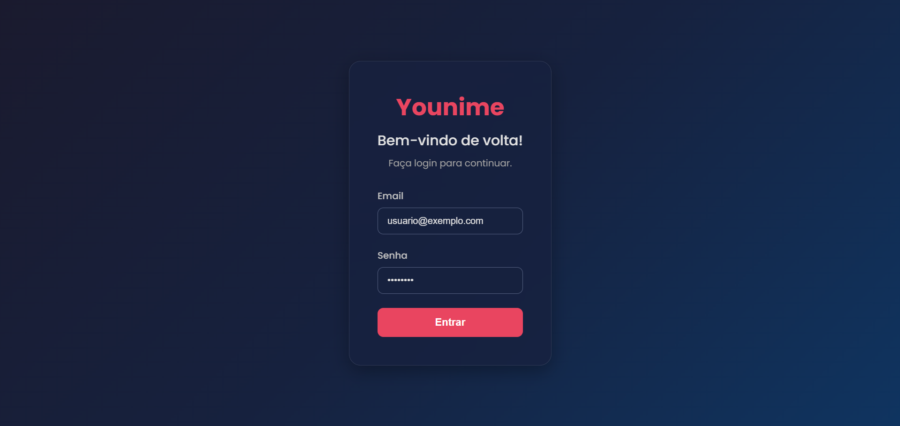
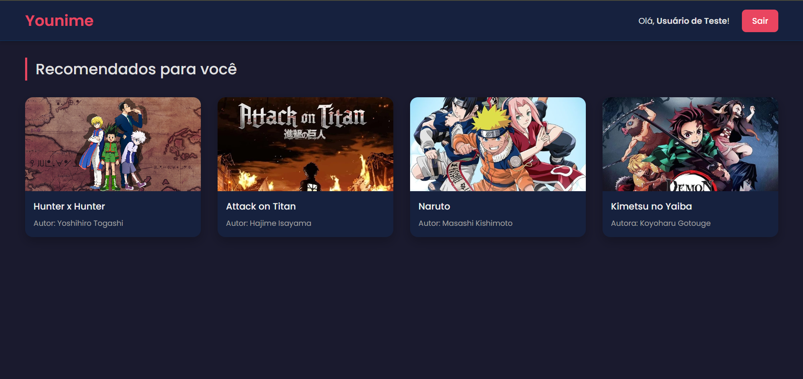

# 📺 Projeto Younime

**Younime** é uma plataforma web moderna e interativa desenvolvida para os fãs de animes. A aplicação oferece uma interface elegante e intuitiva para explorar, buscar e gerenciar animes, com foco na personalização da experiência do usuário.

O projeto foi desenvolvido utilizando a arquitetura MVC (Model-View-Controller) e integra autenticação segura, temas visuais modernos e consumo de API externa para fornecimento de dados atualizados sobre animes.


### 1. Tela de Login
  


### 2. Página Inicial / Dashboard



## 🚀 Funcionalidades

- 🔐 Autenticação de usuários com proteção de rotas

## 🛠️ Tecnologias Utilizadas

| Tecnologia       | Descrição                                                                 |
|------------------|---------------------------------------------------------------------------|
| Node.js          | Ambiente de execução para JavaScript no backend                          |
| Express.js       | Framework para criação do servidor e rotas                                |
| React.js         | Biblioteca para construção da interface de usuário                        |
| MongoDB          | Banco de dados NoSQL para armazenar usuários         |
| Tailwind CSS     | Framework utilitário para estilização rápida e responsiva                 |
| bcrypt.js        | Biblioteca para criptografia de senhas                                    |
| express-session  | Gerenciamento de sessões e cookies                                        |
| dotenv           | Gerenciamento seguro de variáveis de ambiente                             |

## 📁 Estrutura MVC

O projeto segue o padrão **Model-View-Controller**, garantindo organização e escalabilidade:

```

/younime
/projetoback2
|-- /controllers
|   |-- authController.js

|-- /database
|   |-- setup.js
|
|-- /models
|   |-- User.js
|
|-- /public
|   |-- /css
|   |   |-- login.css
|   |   |-- dashboard.css
|   |-- /images
|
|-- /routes
|   |-- auth.js
|
|-- /views
|   |-- login.ejs
|   |-- dashboard.ejs
|-- .env
|-- database.db
|-- .gitignore
|-- package-lock,json
|-- package.json
|-- server.js


```

## 👤 Autor

Feito com ❤️ por [Kauan Pedreira]  
Entre em contato no [LinkedIn](https://www.linkedin.com/in/kauanpedreira/)
